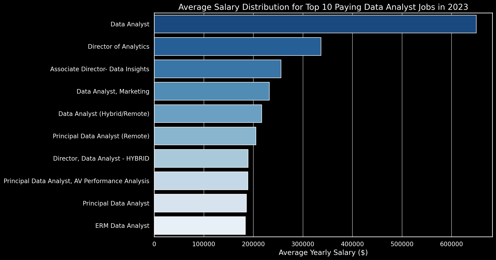

## Introduction
📊 Dive into the data job market! Focusing on data analyst roles, this project explores 💰 top-paying jobs, 🔥 in-demand skills, and 📈 where high demand meets high salary in data analytics.

🔍 SQL queries? Check them out here: [project_sql] (/project_sql/) folder


## Background
Driven by a quest to navigate the data analyst job market more effectively, this project was born from a desire to pinpoint top-paid and in-demand skills, streamlining others work to find optimal jobs.

Data hails from my SQL Course. It's packed with insights on job titles, salaries, locations, and essential skills.

The questions I wanted to answer through my SQL queries were:

1.) What are the top-paying data analyst jobs?

2.) What skills are required for these top-paying jobs?

3.) What skills are most in demand for data analysts?

4.) Which skills are associated with higher salaries?

5.) What are the most optimal skills to learn?

## Tools I Used
For my deep dive into the data analyst job market, I harnessed the power of several key tools:

-**SQL**: The backbone of my analysis, allowing me to query the database and unearth critical insights.

-**PostgreSQL**: The chosen database management system, ideal for handling the job posting data.

-**Visual Studio Code**: My go-to for database management and executing SQL queries.

-**Git & GitHub**: Essential for version control and sharing my SQL scripts and analysis, ensuring collaboration and project tracking.

## The Analysis

### 1.) Top Paying Data Analyst Jobs
To identify the highest-paying roles, I filtered data analyst positions by average yearly salary and location, focusing on remote jobs. This query highlights the high paying opportunities in the field.

``````sql
SELECT 
    job_id,
    job_title,
    name AS company_name,
    job_location,
    job_schedule_type,
    salary_year_avg,
    job_posted_date
FROM 
    job_postings_fact AS j
LEFT JOIN
    company_dim AS c ON j.company_id = c.company_id
WHERE 
    job_title_short = 'Data Analyst' AND
    job_location = 'Anywhere' AND 
    salary_year_avg IS NOT NULL
ORDER BY
    salary_year_avg DESC
LIMIT 10;
``````


*Bar graph visualizing the salary for the top 10 salaries for data analysts; ChatGPT generated this graph from my SQL query results


### 2.) Skills for Top Paying Jobs
To understand what skills are required for the top-paying jobs, I joined the job postings with the skills data, providing insights into what employers value for high-compensation roles.

```sql
WITH top_paying_jobs AS (

    SELECT 
        job_id,
        job_title,
        name AS company_name,
        salary_year_avg
    FROM 
        job_postings_fact AS j
    LEFT JOIN
        company_dim AS c ON j.company_id = c.company_id
    WHERE 
        job_title_short = 'Data Analyst' AND
        job_location = 'Anywhere' AND 
        salary_year_avg IS NOT NULL
    ORDER BY
        salary_year_avg DESC
    
)

SELECT 
    top_paying_jobs.*,
    skills
FROM 
    top_paying_jobs 
INNER JOIN 
    skills_job_dim ON top_paying_jobs.job_id = skills_job_dim.job_id
INNER JOIN 
    skills_dim ON skills_job_dim.skill_id = skills_dim.skill_id
ORDER BY 
    salary_year_avg DESC;
``````

*Bar graph visualizing the count of skills for the top 10 paying jobs for data analysts; ChatGPT generated this graph from my SQL query results


### 3.) In-Demand Skills for Data Analysts
This query helped identify the skills most frequently requested in job postings, directing focus to areas with high demand.

```sql
SELECT 
    skills,
    COUNT(skills_job_dim.job_id) AS demand_count
FROM 
    job_postings_fact
INNER JOIN 
    skills_job_dim ON job_postings_fact.job_id = skills_job_dim.job_id
INNER JOIN 
    skills_dim ON skills_job_dim.skill_id = skills_dim.skill_id
WHERE 
    job_title_short = 'Data Analyst' AND
    job_work_from_home = TRUE
GROUP BY 
    skills
ORDER BY
    demand_count DESC  

LIMIT 5;
```
| Skills   | Demand Count |
|----------|--------------|
| SQL      | 7291         |
| Excel    | 4611         |
| Python   | 4330         |
| Tableau  | 3745         |
| Power BI | 2609         |


### 4.) Skills Based on Salary
Exploring the average salaries associated with different skills revealed which skills are the highest paying.

```sql
SELECT 
    skills, 
    ROUND(AVG(salary_year_avg), 0) AS avg_salary
    
FROM 
    job_postings_fact
INNER JOIN 
    skills_job_dim ON job_postings_fact.job_id = skills_job_dim.job_id
INNER JOIN 
    skills_dim ON skills_job_dim.skill_id = skills_dim.skill_id
WHERE 
    job_title_short = 'Data Analyst' AND
    salary_year_avg IS NOT NULL AND
    job_work_from_home = TRUE
GROUP BY 
    skills 
ORDER BY
    avg_salary DESC

LIMIT 25;
```
| Skills         | Average Salary |
|----------------|----------------|
| PySpark        | 208172         |
| Bitbucket      | 189155         |
| Couchbase      | 160515         |
| Watson         | 160515         |
| DataRobot      | 155486         |
| GitLab         | 154500         |
| Swift          | 153750         |
| Jupyter        | 152777         |
| Pandas         | 151821         |
| Elasticsearch  | 145000         |
| GoLang         | 145000         |
| NumPy          | 143513         |
| Databricks     | 141907         |
| Linux          | 136508         |
| Kubernetes     | 132500         |
| Atlassian      | 131162         |
| Twilio         | 127000         |
| Airflow        | 126103         |
| Scikit-learn   | 125781         |
| Jenkins        | 125436         |
| Notion         | 125000         |
| Scala          | 124903         |
| PostgreSQL     | 123879         |
| GCP            | 122500         |
| MicroStrategy  | 121619         |

### 5.) Most Optimal Skills to Learn
Combining insights from demand and salary data, this query aimed to pinpoint skills that are both in high demand and have high salaries, offering a strategic focus for skill development.

```sql
WITH skills_demand AS (
    SELECT 
        skills_dim.skill_id,
        skills_dim.skills,
        COUNT(skills_job_dim.job_id) AS demand_count
    FROM 
        job_postings_fact
    INNER JOIN 
        skills_job_dim ON job_postings_fact.job_id = skills_job_dim.job_id
    INNER JOIN 
        skills_dim ON skills_job_dim.skill_id = skills_dim.skill_id
    WHERE 
        job_title_short = 'Data Analyst' AND
        salary_year_avg IS NOT NULL AND 
        job_work_from_home = TRUE
    GROUP BY 
        skills_dim.skill_id
    
), 
 average_salary AS (
    SELECT 
        skills_job_dim.skill_id, 
        ROUND(AVG(salary_year_avg), 0) AS avg_salary
        
    FROM 
        job_postings_fact
    INNER JOIN 
        skills_job_dim ON job_postings_fact.job_id = skills_job_dim.job_id
    INNER JOIN 
        skills_dim ON skills_job_dim.skill_id = skills_dim.skill_id
    WHERE 
        job_title_short = 'Data Analyst' AND
        salary_year_avg IS NOT NULL AND
        job_work_from_home = TRUE
    GROUP BY 
        skills_job_dim.skill_id

)

SELECT
    skills_demand.skill_id,
    skills_demand.skills,
    demand_count,
    avg_salary
FROM 
    skills_demand
INNER JOIN
    average_salary ON skills_demand.skill_id = average_salary.skill_id
WHERE
    demand_count > 10
ORDER BY
      avg_salary DESC,
    demand_count DESC
LIMIT 25;
```
| Skills      | Demand Count | Average Salary |
|-------------|--------------|----------------|
| Go          | 27           | 115320         |
| Confluence  | 11           | 114210         |
| Hadoop      | 22           | 113193         |
| Snowflake   | 37           | 112948         |
| Azure       | 34           | 111225         |
| BigQuery    | 13           | 109654         |
| AWS         | 32           | 108317         |
| Java        | 17           | 106906         |
| SSIS        | 12           | 106683         |
| Jira        | 20           | 104918         |
| Oracle      | 37           | 104534         |
| Looker      | 49           | 103795         |
| NoSQL       | 13           | 101414         |
| Python      | 236          | 101397         |
| R           | 148          | 100499         |
| Redshift    | 16           | 99936          |
| Qlik        | 13           | 99631          |
| Tableau     | 230          | 99288          |
| SSRS        | 14           | 99171          |
| Spark       | 13           | 99077          |
| C++         | 11           | 98958          |
| SAS         | 63           | 98902          |
| SQL Server  | 35           | 97786          |
| JavaScript  | 20           | 97587          |


## What I Learned
Throughout this adventure, I've turbocharged my SQL toolkit with some serious firepower:

🧩 **Complex Query Crafting**: Mastered the art of advanced SQL, merging tables like a pro and wielding WITH clauses for ninja-level temp table maneuvers.

📊 **Data Aggregation**: Got cozy with GROUP BY and turned aggregate functions like COUNT() and AVG() into my data-summarizing sidekicks.

💡 **Analytical Wizardry**: Leveled up my real-world puzzle-solving skills, turning questions into actionable, insightful SQL queries.

## Conclusions
 Insights
From the analysis, several general insights emerged:

1.) Top-Paying Data Analyst Jobs: The highest-paying jobs for data analysts that allow remote work offer a wide range of salaries, the highest at $650,000!

2.) Skills for Top-Paying Jobs: High-paying data analyst jobs require advanced proficiency in SQL, suggesting it’s a critical skill for earning a top salary.

3.) Most In-Demand Skills: SQL is also the most demanded skill in the data analyst job market, thus making it essential for job seekers.

4.) Skills with Higher Salaries: Specialized skills, such as SVN and Solidity, are associated with the highest average salaries, indicating a premium on niche expertise.

5.) Optimal Skills for Job Market Value: SQL leads in demand and offers for a high average salary, positioning it as one of the most optimal skills for data analysts to learn to maximize their market value.


## Closing Thoughts
This project enhanced my SQL skills and provided valuable insights into the data analyst job market. The findings from the analysis serve as a guide to prioritizing skill development and job search efforts. Aspiring data analysts can better position themselves in a competitive job market by focusing on high-demand, high-salary skills. This exploration highlights the importance of continuous learning and adaptation to emerging trends in the field of data analytics.